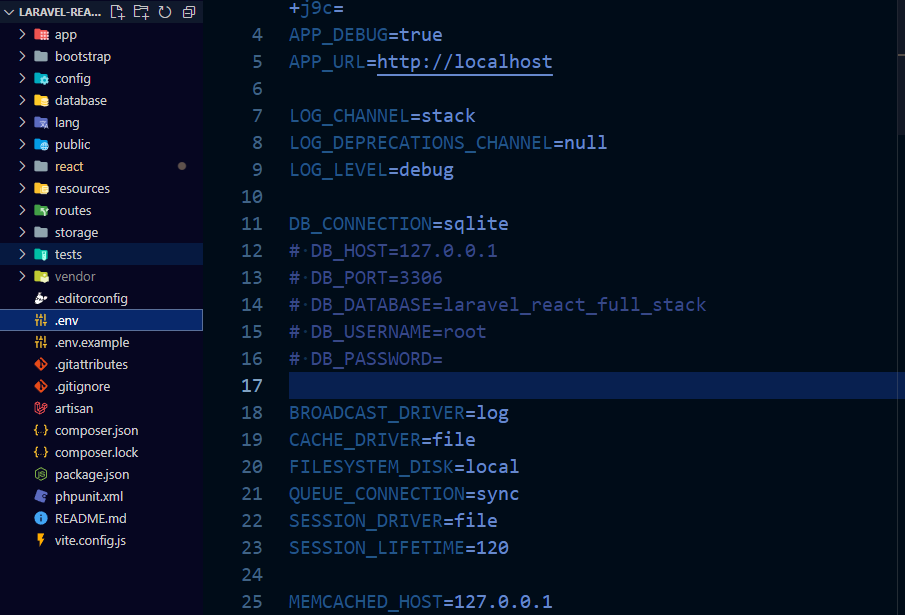
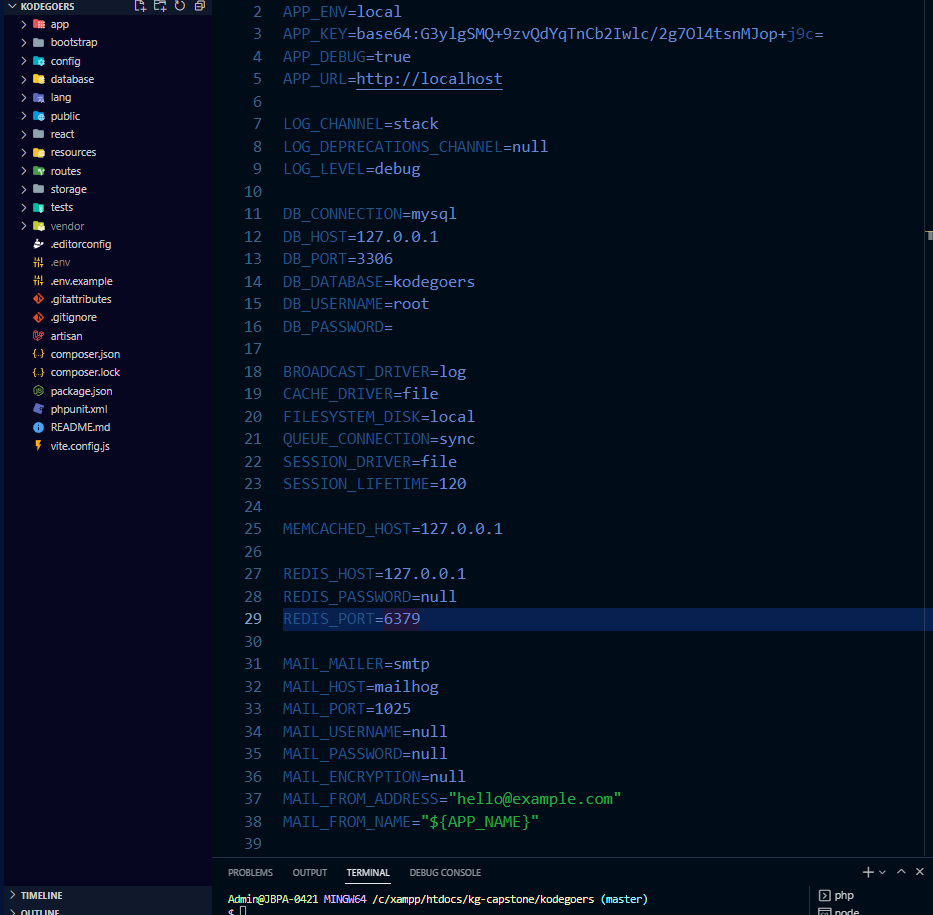
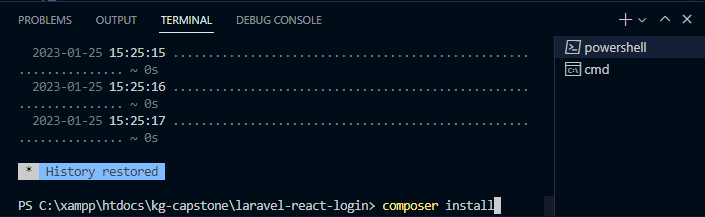
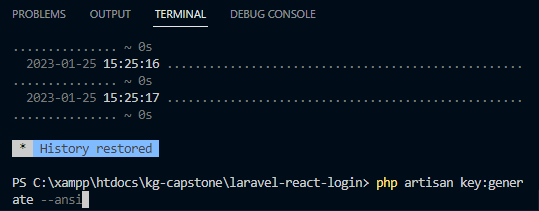
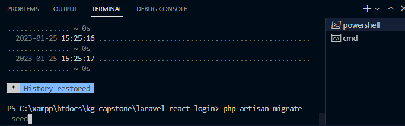
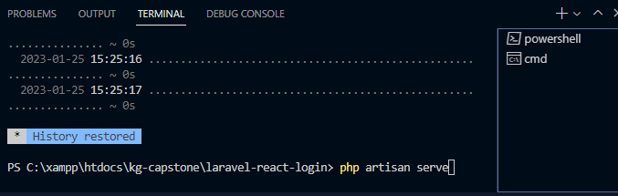
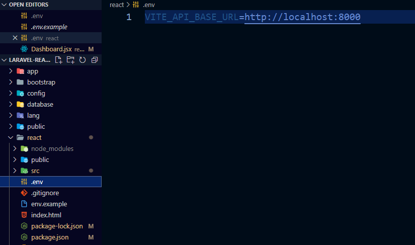
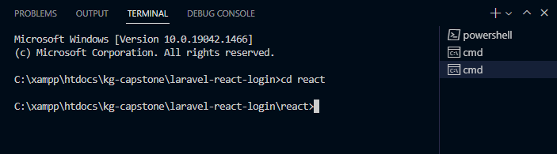

# Project Set-up

Guide URL: https://jhonas.notion.site/Project-Set-up-121175d0679843c684f035b4b0b3c6cf

This is a guide on how to run the source code in your local machine. Make sure you have environment setup properly. You will need PHP8.1, composer and Node.js.

Necessary tools

- PHP
- Xampp
- Composer - make sure this is installed ([https://getcomposer.org/](https://getcomposer.org/))
- Laravel
1. Clone the Repo using Git Clone
    1. enter the following code in the chosen directory, ‘git bash here’ then `git clone https://github.com/hellojhonas/kodegoers.git`
2. Open the folder in VS code.
3. Create a `.env` file in the root directory and copy the text inside `.env.example`
4. In the `.env` file. To get started 
    
    Option A: Real quick with the database, comment out `DB_HOST until DB_PASSWORD` . Then just enter sqlite for the DB_Connection.
    
    
    
    Option B: Have your local MySQL Database Ready with your preferred DB_Database.
    
    
    
5. Open a terminal and navigate to the project's root directory 
6. Run `*composer install*`
    
    
    
7. Set the encryption key by executing `php artisan key:generate --ansi`
    
    
    
8. Run migrations `php artisan migrate --seed`
    
    
    
9. Start local server by executing `php artisan serve`
    
    
    
10. Go to the react folder, create a `.env` file then Copy `react/.env.example` into `.env` 
    
    
    
11. Open another new terminal and navigate to the `react` folder
    
    
    
12. Run `npm install` to install necessary packages.
13. Lastly, run `npm run dev` to start vite server for React
14. Make sure the Back-end is up and running with the command: `php artisan serve` in step 9. then click/open the provided uri from `npm run dev`: `http://localhost:3000/`